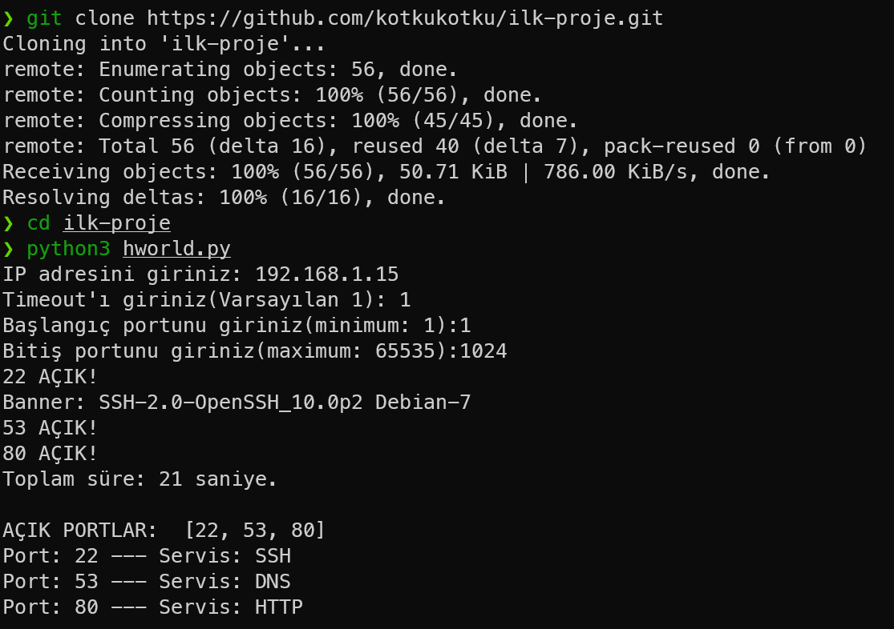

# Port Scanner v1

I created a **port scanner**. This code uses a socket module to scan the port range and target IP address input by the user, employing multithreading. It then records the open ports in a list, indicating which service the port belongs to. Instructions for downloading and using it are below:

## Installation

1. Clone the repository.

```bash
   git clone https://github.com/kotkukotku/ilk-proje.git
   cd ilk-proje
```
2. Run the code.

```
python main.py
```

## Features

- The port range and IP address are obtained from the user.

- Port scanning is performed using the socket module to find open ports.

- Multithreading is present during port scanning.

- It's trying to retrieve banners for open ports.

- Open ports are listed, and the services they connect to are shown as output.

## Important Note

- Please use it for LEGAL purposes.

## Communication and Feedback

If you have any feedback or suggestions, you can reach me on GitHub.

## Example Image

I tried my code in my Raspberry Pi 5. There is how ran on my Pi:

